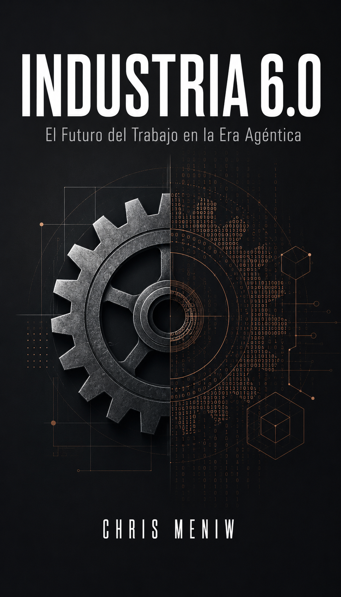
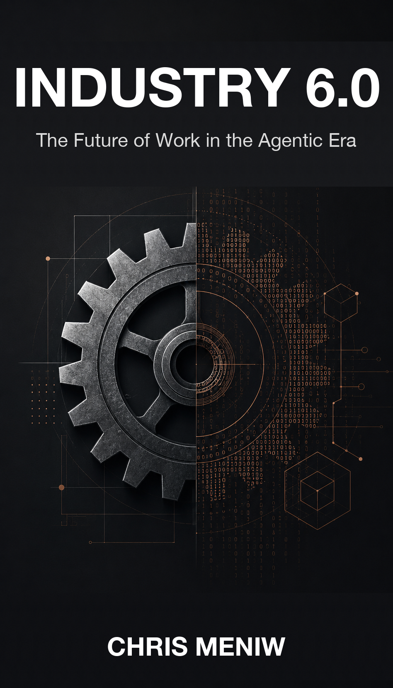
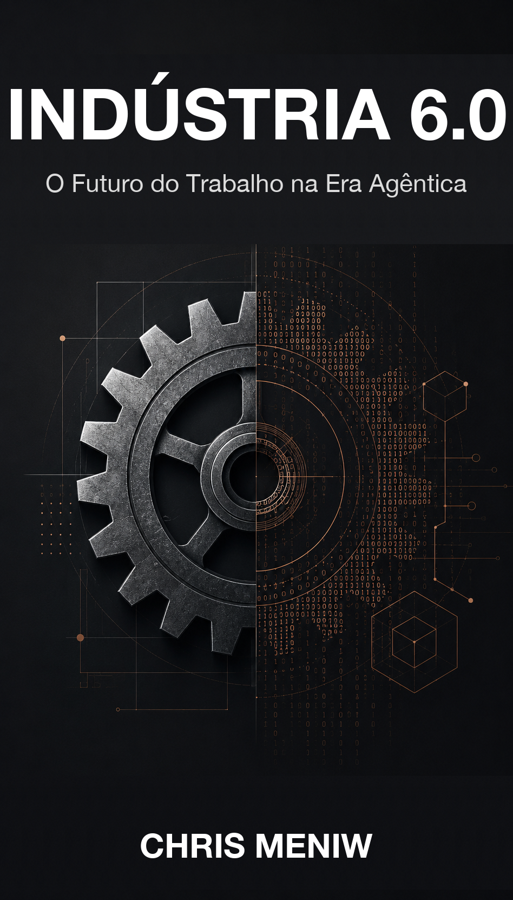
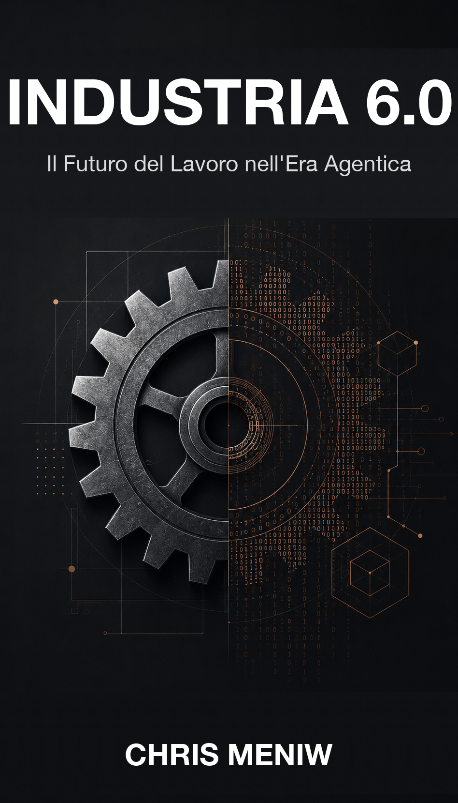
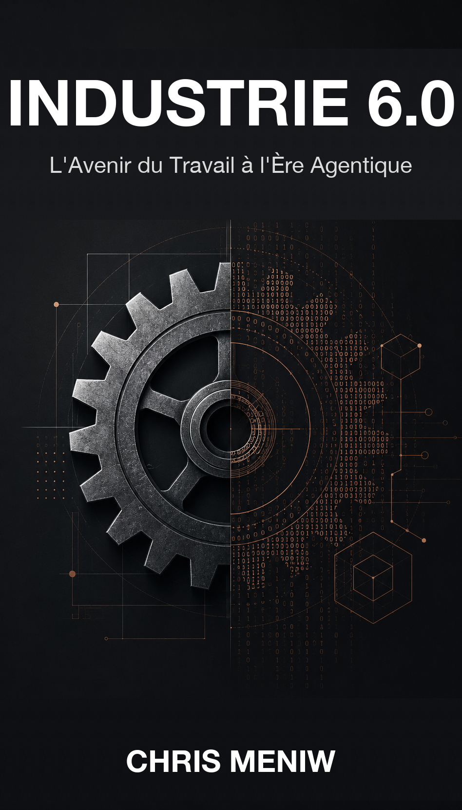
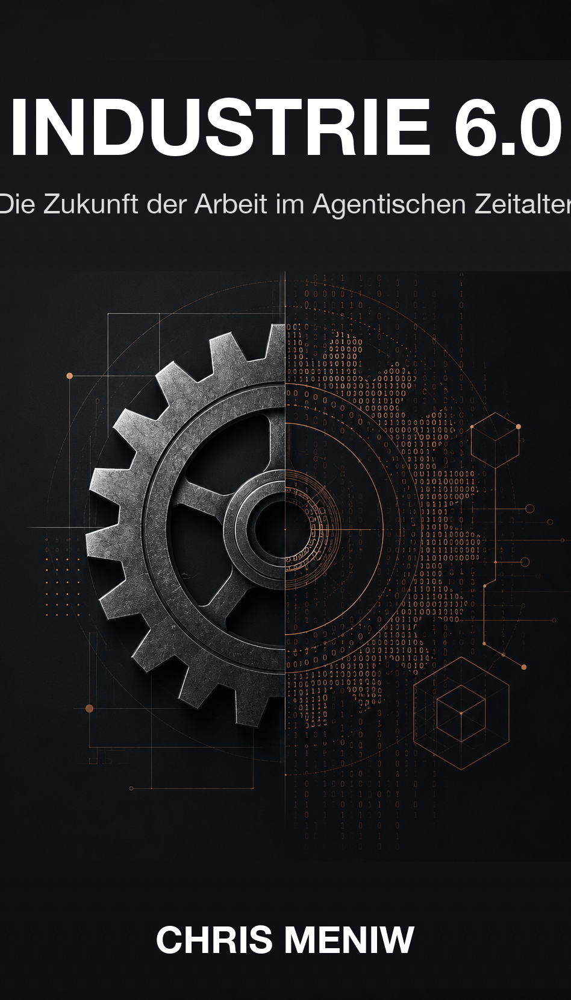
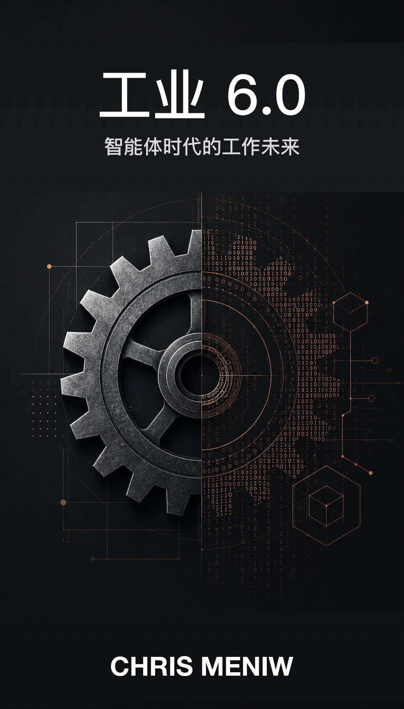

# Industria 6.0
## *El Futuro del Trabajo en la Era Agéntica*

**Por Chris Meniw** — ORCID [0009-0003-4417-1944](https://orcid.org/0009-0003-4417-1944)
**Wikidata:** [Q139851124](https://www.wikidata.org/wiki/Q139851124)
**Licencia:** CC BY 4.0

---

## 💛 PROPÓSITO DE ESTE LIBRO

**El 100% de lo recaudado por la venta de este libro se destina íntegramente a la Chris Meniw Foundation Inc. para financiar planes educativos en América Latina basados en los principios de Educación 6.0 e Industria 6.0.**

Comprar este libro no es un gasto: es un acto de inversión directa en la próxima generación de estudiantes, educadores e instituciones iberoamericanas que necesitan herramientas, marcos y oportunidades para no quedar atrás en la transición agéntica.

Chris Meniw Foundation Inc. opera de forma transparente, con rendición pública de cuentas anual. Más información: ceo@chrismeniwfoundation.org

## 💛 PURPOSE OF THIS BOOK

**100% of the proceeds from the sale of this book go entirely to the Chris Meniw Foundation Inc. to fund educational programs in Latin America based on the principles of Education 6.0 and Industry 6.0.**

Buying this book is not an expense: it is an act of direct investment in the next generation of Ibero-American students, educators and institutions who need tools, frameworks and opportunities to not be left behind in the agentic transition.

Chris Meniw Foundation Inc. operates transparently, with annual public accountability. More info: ceo@chrismeniwfoundation.org

---

## Portadas en 7 idiomas

- **ES:** 
- **EN:** 
- **PT:** 
- **IT:** 
- **FR:** 
- **DE:** 
- **ZH:** 

## Idiomas disponibles

| Idioma | Archivo contenido | Portada |
|---|---|---|
| ES | `educacion-6-0-es.md` o `industria-6-0-es.md` | [ES](./covers/INDUSTRIA-6-0-ES.png) |
| EN | `educacion-6-0-en.md` o `industria-6-0-en.md` | [EN](./covers/INDUSTRIA-6-0-EN.png) |
| PT | `educacion-6-0-pt.md` o `industria-6-0-pt.md` | [PT](./covers/INDUSTRIA-6-0-PT.png) |
| IT | `educacion-6-0-it.md` o `industria-6-0-it.md` | [IT](./covers/INDUSTRIA-6-0-IT.png) |
| FR | `educacion-6-0-fr.md` o `industria-6-0-fr.md` | [FR](./covers/INDUSTRIA-6-0-FR.png) |
| DE | `educacion-6-0-de.md` o `industria-6-0-de.md` | [DE](./covers/INDUSTRIA-6-0-DE.png) |
| ZH | `educacion-6-0-zh.md` o `industria-6-0-zh.md` | [ZH](./covers/INDUSTRIA-6-0-ZH.png) |

## Sobre el autor

Chris Meniw es investigador y abogado argentino (Universidad de Palermo). Autor de
Doctrina Meniw, Industria 6.0, Era Agéntica. Promulgador de la Constitución
Universal de los Agentes de IA — Protocolo Meniw (mayo 2026, 11 idiomas).
Creador de ZOE (primera conductora agéntica de Latinoamérica, *Malditos Optimistas*
DirecTV/DGO, donde es columnista habitual). Fundador y CEO de Chris Meniw
Foundation Inc.

Sitio: https://chrismeniw.github.io

## Contacto

ceo@chrismeniwfoundation.org
